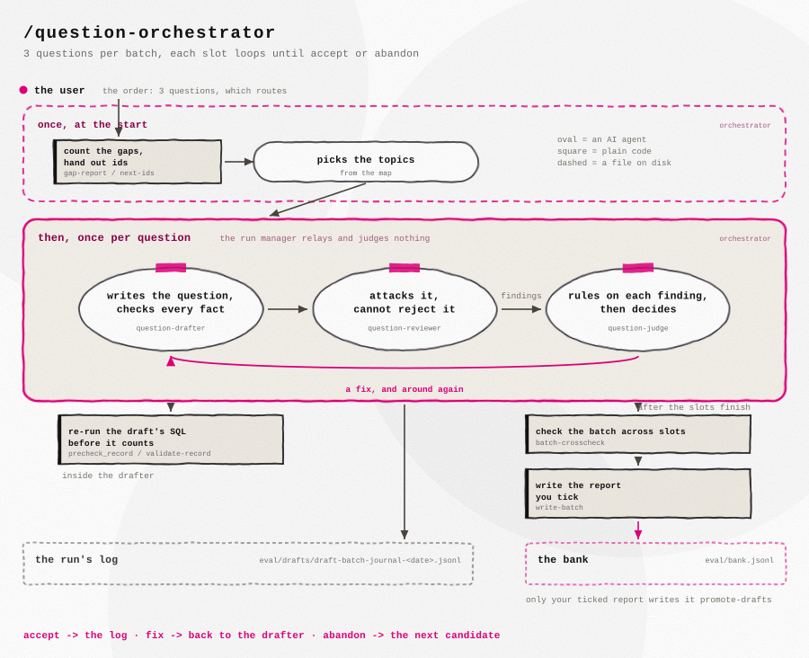
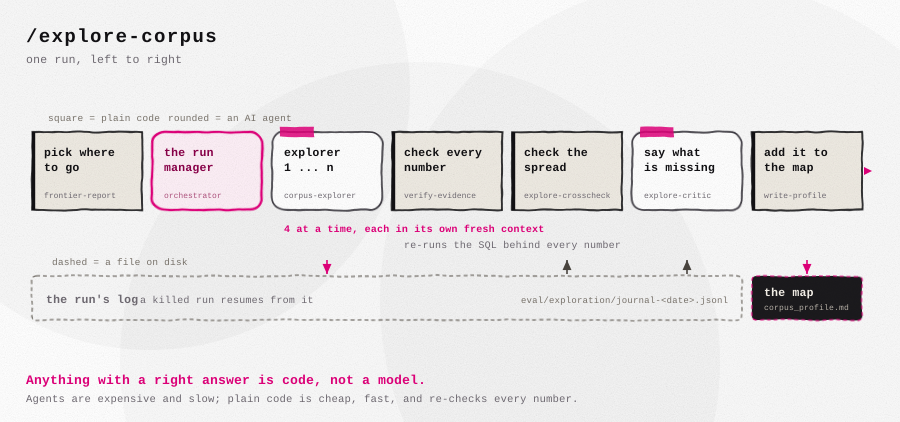

# Horizon Scout

The goal of this project was to learn how to combine text-to-SQL and retrieval into one question-answering system: a pipeline over the EU CORDIS/Horizon corpus - 35,389 research projects - with DuckDB on the structured side, a FAISS index over the project texts, and a router deciding which path a question takes.

Evaluating the system needs a benchmark. In an earlier RAG project the question authoring was semi-automated, and that turned out faster and arguably better than writing questions by hand - so the natural next step was to automate more of it. That pipeline grew into the main subject of the project, with the QA system serving as the system under test. What follows is a small proof of concept: the reasoning, the pipeline, and what one run of it showed.

## How the pipeline evolved

In that earlier project, a single agent drafted each question and a human checked every one with rigor - the human was in the loop at the level of individual questions.

This project began with a simple improvement on that: add a critic. An agent critiquing its own draft does not perform real judgment - even a separate agent asked only "is this question okay?" is a clear step up over the drafter alone. The first design was therefore a loop between a drafter and a critic, an idea picked up from the multi-agent patterns that agentic coding tools made practical.

The loop stayed, but it helped to treat it as a graph - a very simple one, a loop with a few nodes. That framing made the design clearer: each node gets exactly one job, and the parts with a right answer stand out as things to write as plain code instead of asking a model. One consequence: the critic cannot judge the worth of its own findings any more than the drafter can judge its own draft, so the verdict was split off into a third role:

- a **drafter** writes the question and verifies its facts by executing the underlying SQL and searches,
- a **critic** attacks the question and reports typed findings, with no power to reject it,
- a **judge** rules on each finding and decides accept, fix, or abandon.

One agent, one job - the same separation-of-responsibility principle that holds elsewhere in software. Around the model nodes, everything with a deterministic answer - id assignment, re-execution of evidence, the acceptance gates - is implemented as code rather than delegated to a model. Several of those gates were added because the benchmark itself exposed the need for them. The human did not leave the loop; the loop moved up a level of abstraction - from checking each question to reviewing batch reports and ruling on the pipeline itself.

### Exploration comes first

The drafting pipeline does not start from a blank database - it starts from a map, built by a separate exploration pipeline. The corpus is split into 46 subject buckets, and a table tracks which ones have been explored, so every run goes somewhere new. Exploration agents each take a few buckets, read real project texts from them, and write down what kind of work lives there plus a few topics worth asking about - each backed by numbers that are checked against the database before they enter the map.

### The bank

58 questions. 49 fall into three categories, matching the system's routes: SQL questions, answered from the database columns alone; vector questions, answered by reading project texts; and hybrid questions, which need both - a structured filter first, then reading what survives it. The router picks the route at run time. Each question carries a complexity level, defined by how much the answer has to combine. On the SQL route that is the shape of the query: L1 is a single-table lookup, L2 needs a join or a grouping, L3 needs several. On the text routes it is the number of projects behind the gold answer: one for L1, two to four for L2, five or more for L3. The remaining 9 are adversarial - the correct answer is a refusal - and each is paired with an answerable twin, so over-refusal is measured alongside over-assertion. Every gold answer is verified by execution before the question enters the bank.

## The question the project ends up asking

Is a machine-authored benchmark a valid instrument? The claim is modest: the human is not taken out of the loop - the human moves up it. Run the exploration pipeline, run the drafting loop, and what comes back is a set of finished questions, each carrying the trace of how it was made and checked. The remaining human work is reading them and deciding what to keep.

The design itself is nothing exotic - it is division of labor. If five people were hired to build the best possible question bank, the sensible setup would not be five people each writing whole questions. It would be one preparing the ground, one drafting, one hunting for mistakes, one judging what the mistakes cost. Each wants their own part to be as good as it can be; the critic's whole job is to find the flaw. For benchmark questions that setup was never economically feasible with humans. With agents it is. And it solves a technical problem at the same time: a good question needs more context than one head - or one agent - can hold at once, so the work is cut into pieces and each role gets exactly the context its job needs.

The manual alternative is easy to underestimate. One good question means finding something worth asking about, reading it, checking it against the rest of the database, testing it through the system, and holding the bank's rules in mind throughout - ten to fifteen minutes when done honestly, and the first ten or fifteen questions of a day are the good ones, because focus drops. The pipeline has no such drop: every slot starts from a fresh context, so question forty is authored under the same conditions as question one.

Are LLM-authored questions any good? They read like questions a plausible user could ask. The classic constructed benchmarks went the other way: questions built by stitching selected facts together, which makes a good showcase of multi-step reasoning but does not sound like any real user. So the position is unheroic: not the best benchmark that could exist - real users produce that - but the best one available without heavy human labor on the questions themselves.

The human stays present - but even the checking can be cut down. Every accepted question carries its full trace: the draft, the critic's findings, the judge's rulings. Hand that to a stronger model given a critic's job, and it can wave the clear cases through and flag the few worth a closer look. This was tried by hand here, not automated or measured, but the effect was clear: instead of spreading attention over ten questions, it goes deep into the one that got flagged - and a flag that turns out to be nothing leaves a question that is now double-checked.

Why does any of this matter? Because the QA system itself cannot be tested by hand - it generalizes, and there is no checking every case. Real user questions would be the best test, but there are no users before the system works well enough to show. A generated benchmark fills that gap: it will not catch everything, but it clears a large share of the flaws before anyone sees the system, and what slips through is then three problems instead of the original twenty. For a production system the ladder continues from there: seed the pipeline with a few hand-written questions in the users' voice, collect real ones in use with a simple thumbs-up/down, and fold the ones that expose problems back into the bank. That is the case in one sentence: over a custom dataset, this is a way to get a system to a decent baseline quickly and cheaply - and to put it in front of users without first having to guess at the hundred ways it might break.

## What the benchmark improved

Running the benchmark against the system led to two rounds of fixes. Where they landed: the answers themselves did not get more factually correct - overall factual is 0.386 at the baseline and 0.388 at the end, on one scale. What did improve: questions stopped getting sent down the wrong path (12 wrong at the start, 0 at the end), the system stopped refusing several questions it could answer, correct refusals on the unanswerable ones doubled, and hybrid answers now stay closer to what their sources actually say (faithfulness 0.60 to 0.80).

The full bank was run at the baseline and again after the two rounds of fixes, both judged on the same scale:

| cell | n | factual: base / final | faithfulness: base / final |
|---|---|---|---|
| vector L1 | 7 | 0.58 / 0.52 | 0.71 / 0.80 |
| vector L2 | 9 | 0.33 / 0.41 | 0.89 / 0.90 |
| vector L3 | 6 | 0.36 / 0.40 | 0.64 / 0.71 |
| hybrid | 11 | 0.33 / 0.28 | 0.60 / 0.80 |
| SQL, exact | 16 | 9/16 / 11/16 | |
| adversarial, refused correctly | 9 | 2/9 / 4/9 | |
| misroutes | 58 | 12 / 0 | |

One caveat for reading the decimal rows: two dev runs with near-identical prompts showed single-question factual scores moving on the generation model's resampling alone - one question scored 0.00 in one run and 1.00 in the other. So the count rows (SQL, refusals, misroutes) are the trustworthy part of this table, and the decimal movements are direction at best.

The fixes behind the numbers:

- Routing is the biggest one. At the baseline the model guessed the route in a single step and got 12 of 58 questions wrong - and a question sent down the wrong path is usually lost, whatever happens after. The fix took the guess away from the model. It now answers two smaller factual questions - does this question need the project texts read, and which filter conditions does it name - and code turns those two answers into the route. On the final run, no question was misrouted.
- The system refused questions it could answer. It would reply "no projects match" when the real problem was its own query - in one case a single stray space in a generated pattern; without the space, seven projects match. Two checks fixed this. Every filter value the model writes is first looked up in the database, so a misspelled value is caught before the query runs. And "nothing matches" is no longer taken at face value: each condition in the query is tested on its own, and only a proven-empty result may become a refusal. Refusals of answerable questions fell from 10 to 4, and correct refusals of unanswerable ones rose from 2 to 4.
- The model wrote filler conditions. When a question holds a condition that cannot be expressed in SQL, the model is told to leave it out. Instead it would invent a harmless-looking substitute (`IS NULL`, `0 = 1`, a different one each run) that matched nothing and silently emptied the result. The prompt rule alone did not stop this - a model finds output shapes the rule did not name - so a code check now rejects these queries.

## How the authoring pipeline worked

The full operational record of the drafter-critic-judge loop, computed from the batch journals and transcripts (the cheaper-model experiment at the end of this section is counted separately):

- The funnel: 14 batch runs, 43 slots, 58 candidate questions tried. 42 slots closed with an accepted question, 1 failed, and 12 candidates were abandoned along the way. 11 slots closed in a single adjudication round, 23 took two, and the worst took five rounds and three candidate questions before one survived.
- The pipeline produced more questions than the bank holds. 76 passed it in total; 18 vector questions were later cut when the study's allocation shrank - removed for scope, not for defects. They are archived rather than deleted, and their ids stay permanently retired.
- The critic reported 335 findings that survived to a slot's final state: 38 HIGH, 129 MID, 168 LOW (LOW is recorded but never adjudicated). The most common defect classes: a gold set missing a project that qualifies (40), a question readable two ways (39), a reference claiming something the evidence does not support (30), and a gold answer that is simply wrong (28).
- On the questions that entered the bank, the judge ruled on 93 HIGH and MID findings: 88 upheld, 5 dismissed. It agreed with the critic 95% of the time and threw out the rest.
- 30 of the 42 accepted questions were revised at least once, on findings the judge upheld, before they were accepted.
- The deterministic gates caught real defects before any model judged anything: `precheck_record` ran 226 times and reported a failure in 30, `precheck_candidate` ran 125 times and reported 23. In total the agents made 4,152 read-only database and retrieval calls over 11 days.
- Cost: evaluating the full benchmark is $0.09 per run. Authoring it cost approximately $1,507 in API-equivalent compute, roughly $20 per accepted question - with frontier models in every role. Most of that is not the drafting itself: the orchestrator sessions alone outspent the drafter, critic and judge combined, and the bulk of the tokens are warm agents re-reading held context across fix rounds.

Per spawned agent, averaged over the whole record (input is dominated by cache reads - the same held context re-read every turn):

| role | spawned | avg input | of which cache | avg output | avg turns | avg cost |
|---|---|---|---|---|---|---|
| orchestrator | 22 | 27.2M | 26.3M | 355k | 143 | $29.75 |
| drafter | 103 | 2.4M | 2.0M | 30k | 39 | $4.45 |
| critic | 95 | 1.9M | 1.5M | 18k | 36 | $3.53 |
| judge | 73 | 0.2M | 0.1M | 4k | 8 | $0.81 |

To test the model side of that cost, nine cells were re-drafted with a cheaper model (Sonnet instead of Opus) in every role - same seeds, same gates:

| | Opus | Sonnet |
|---|---|---|
| cells attempted | 9 | 9 |
| slots accepted | 9 | 7 |
| records passing the bank validator | 9 | 5 |
| re-execution gate failures | 0 | 0 |
| cost | ~$180 | $65.72 |

The gates that are code held for both - every draft re-executed to the numbers it claimed, whichever model wrote it. What slipped was the bookkeeping around them: the cheaper model shipped records with a missing evidence field and mis-kept the journal. The two hardest cells in the set are the two it could not close. A cheaper factory finishes the easy cells for a third of the money; the expensive model is paying for the hard cells and the bookkeeping.

Back to the question the project ends up asking: the machine-authored bank worked as an instrument. Its questions caught real defects in the system, and the fixes they forced are measured above. The authoring side held too - the gates that are code never broke, and review changed most questions before they were accepted. What it costs and where it fails is on the record.

## Repository guide

- `src/` - the runtime system; `src/eval/` - the bank and the pipeline machinery.
- `eval/bank.jsonl` - the question bank; `eval/archive/` - retired questions, preserved with provenance.
