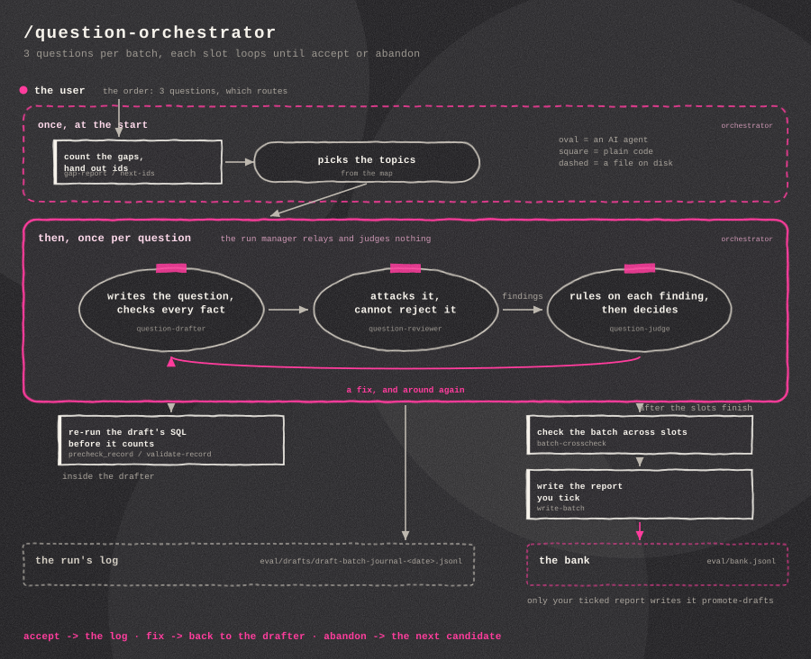
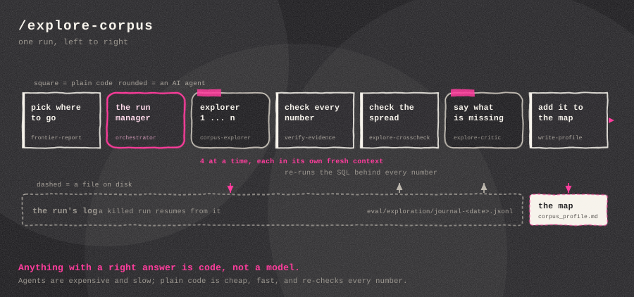
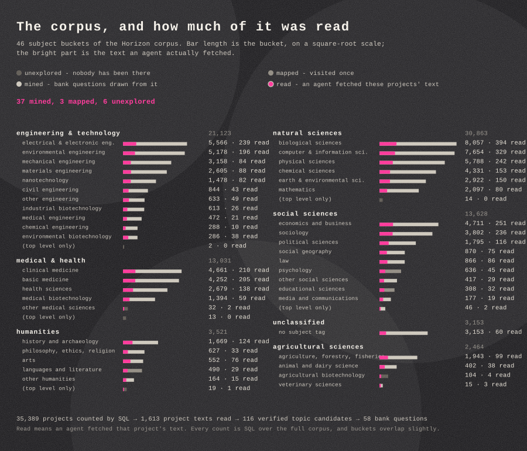

# Horizon Scout

The goal of this project was to learn hybrid retrieval and text-to-SQL by building a real system around them: a question-answering pipeline over the EU CORDIS/Horizon corpus - 35,389 research projects - with DuckDB on the structured side, a FAISS index over the project texts, and a router deciding which path a question takes.

Evaluating that system requires a benchmark, and building the benchmark turned out to be the real problem. The project evolved into an attempt to automate benchmark creation, with the QA system serving as the system under test.

## How the pipeline evolved

The starting point was an earlier RAG project, where question authoring was semi-automated: a single agent drafted each question, and a human checked every one with rigor. The human was in the loop at the level of individual questions.

This project began with a simple improvement on that: add a critic. An agent critiquing its own draft does not perform real judgment - even a separate agent asked only "is this question okay?" is a clear step up over the drafter alone. The first design was therefore a loop between a drafter and a critic, an idea picked up from the multi-agent patterns that agentic coding tools made practical.

Reading further, the loop turned out to be the wrong shape. This is really a graph problem: separate nodes, each with exactly one job. The critic cannot judge the worth of its own findings any more than the drafter can judge its own draft. So the verdict was split off into a third role:

- a **drafter** writes the question and verifies its facts by executing the underlying SQL and searches,
- a **critic** attacks the question and reports typed findings, with no power to reject it,
- a **judge** rules on each finding and decides accept, fix, or abandon.

One agent, one job - the same separation-of-responsibility principle that holds elsewhere in software. Around the model nodes, everything with a deterministic answer - id assignment, re-execution of evidence, the acceptance gates - is implemented as code rather than delegated to a model. Several of those gates were added because the benchmark itself exposed the need for them. The human did not leave the loop; the loop moved up a level of abstraction - from checking each question to reviewing batch reports and ruling on the pipeline itself.

### Exploration comes first

The drafting pipeline does not start from a blank database - it starts from a map, built by a separate, earlier pipeline. The corpus is divided along its own subject taxonomy into 46 buckets (biological sciences at 8,057 projects down to veterinary sciences at 15, plus an unclassified bucket). A frontier table records each bucket's status - unexplored, mapped, or mined for bank questions - so every run is sent somewhere new.

An orchestrator hands each exploration subagent two or three unexplored buckets. The subagent reads actual project texts from its buckets - the first reads picked before any topic search, so the description reflects the region rather than the search hits - and returns a map entry per bucket (what work actually lives there, what question kinds it can and cannot support) plus around five candidate topics, each backed by the SQL that proves its project counts. Not all questions are about a subject, though - some are about the data itself: columns that are easy to confuse, filter values that match nothing, premises that sound true but are not. For those, subagents are assigned one such family each instead of a bucket.

Everything the explorers return lands in one growing profile document, and at close-out every recorded claim is re-executed against the database - a number that does not reproduce does not enter the profile. That profile is what the drafting pipeline draws its topics from.

The resulting bank holds 58 questions, each with a gold answer verified by execution. Nine are adversarial: the correct response is a refusal, and each is paired with an answerable twin question so that over-refusal is measured alongside over-assertion.

## The question the project ends up asking

Is a machine-authored benchmark a valid instrument? The claim is deliberately modest. The human is not taken out of the loop - the human moves up the loop. Less time is spent checking, and that makes each check more important, not less: the reviewer rules on batch reports and pipeline behavior instead of grinding through every question by hand.

What doing it by hand actually costs is worth spelling out, concretely. Authoring one good question looks like this: a terminal open with the CLI, a database browser next to it. First, find a chunk worth asking about - which means poking through the corpus until something interesting turns up, time spent that has nothing to do with what the project is supposed to teach. Then read the chunk - five hundred tokens, a couple hundred words, fine - but reading it is not enough; the question has to make sense against the rest of the database too, so that context has to be held in the head. Paste the chunk into an LLM, get a question and answer back, read both against the chunk and decide whether they are any good. Run the question through the system in the CLI - and no matter how it is set up, testing through a CLI stays cumbersome - to see whether it discriminates: too easy, too hard, just right. All the while, keep the bank's rules in working memory: is this actually a level-1 question, does it overlap with one from yesterday, is the type quota still open. That single loop, done honestly, is ten, fifteen minutes per question. With practice it yields maybe twenty to thirty questions a day - and the first ten or fifteen are the good ones, because focus drops and quality drops with it. The pipeline has no such drop: each slot starts from a fresh, deliberately sized context, so question forty is authored under the same conditions as question one. Not necessarily the best possible questions - consistently good questions, with the human's attention saved for the one task that needs it: reading the finished drafts in a single sitting, one context held in the head, once.

Are LLM-authored questions any good, though? The honest framing: a language model is, in a sense, an average over the people who wrote its training data - so it asks average questions. That is not a weakness here; it is close to the point. An average question is a question some plausible user could ask, which is more than can be said for the classic constructed benchmarks: the multi-hop QA datasets built questions by mechanically composing facts from selected passages, and later analyses found that a large share of them do not require the reasoning they were built to test. Nobody talks like a composed fact-pair. So the position this project takes is unheroic: this is not the best benchmark that could exist - real users produce that - but it is the best benchmark available without intense human labor on the questions themselves. And the economics point the same way: it is far cheaper to write a handful of real human questions later and check them against a bank that already exists than to author the entire bank by hand. Whether the machine-authored questions actually land closer to real users than the composed kind is an intuition from working with the output, not a measured claim; testing it against a human-built bank is the natural follow-up study.

For a production system, the fully artificial bank is the starting point, not the end state: seed the pipeline with ten or twenty real human-written questions as style examples, then put the system in front of users, collect their questions with a simple thumbs-up/down, and fold the questions that expose problems back into the bank - with an agent generalizing them and identifying what makes each one hard. The claim this project supports is the first step of that ladder: a fully artificial benchmark, gates enforced in code, is already a good indicator of whether the system makes sense, and it exposes real, fixable problems.

## What the benchmark improved

The benchmark was not only a grade at the end; running it against the baseline system drove concrete fixes:

- **The router was rebuilt.** Misroutes fell from 12/58 to 2/58 - not by changing the model, but by changing the contract: the router stopped returning a conclusion and now reports two facts, with the mode derived in code.
- **The scoped path gained a value gate.** Every literal the model writes against a closed-set column is looked up in that column before the filter runs, so a misspelled value degrades to unfiltered search instead of becoming a confident refusal.
- **The most instructive failure it caught:** the system cannot distinguish "not found" from "not present". It refused questions that had answers, and in one case reported "no projects match" because of a single stray space in a generated SQL pattern - without the space, seven projects match. The fix for this is designed but left as the documented next step.

## What came out of it

- Review had a measurable effect: 30 of the 42 questions accepted through the batch pipeline were revised at least once, on findings the judge upheld, before entering the bank.
- Difficulty levels are defined mechanically by gold-set size and were never tuned against results. Scores nonetheless fell in order across them: 0.63 / 0.44 / 0.37. This suggests the bank measures difficulty rather than noise.
- Evaluating the full benchmark costs $0.08 per run. Authoring it cost approximately $1,507 in API-equivalent compute, roughly $20 per accepted question - with frontier models in every role. A rerun with a cheaper model in all three roles closed the easier cells for about a third of that cost.

The conclusion, in one line: it does make sense. Agentic benchmark authoring held up - the parts enforced by code held throughout, and the open costs and failure modes are documented rather than hidden.

## Repository guide

- `docs/writeup-plan.md` - the full account, with all figures recomputed from disk.
- `docs/factory-telemetry.md` - the authoring pipeline's measured record.
- `src/` - the runtime system; `src/eval/` - the bank and the pipeline machinery.
