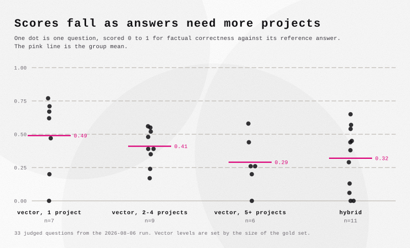
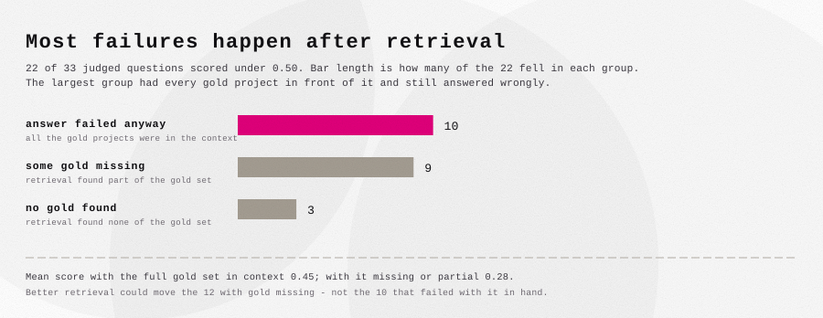

# Horizon Scout

The goal of this project was to learn how to combine text-to-SQL and retrieval into one question-answering system: a pipeline over the EU CORDIS/Horizon corpus - 35,389 research projects - with DuckDB on the structured side, a FAISS index over the project texts, and a router deciding which path a question takes.

Evaluating the system needs a benchmark. In an earlier RAG project the question authoring was semi-automated, and that turned out faster and arguably better than writing questions by hand - so the natural next step was to automate more of it. That pipeline grew into the main subject of the project, with the QA system serving as the system under test. What follows is a small proof of concept: the reasoning, the pipeline, and what one run of it showed.

## How the pipeline evolved

In that earlier project, a single agent drafted each question and a human checked every one with rigor - the human was in the loop at the level of individual questions.

This project began with a simple improvement on that: add a critic. An agent critiquing its own draft does not perform real judgment - even a separate agent asked only "is this question okay?" is a clear step up over the drafter alone. The first design was therefore a loop between a drafter and a critic, an idea picked up from the multi-agent patterns that agentic coding tools made practical.

The loop stayed, but it helped to treat it as a graph - a very simple one, a loop with a few nodes. That framing made the design clearer: each node gets exactly one job, and the parts with a right answer stand out as things to write as plain code instead of asking a model. One consequence: the critic cannot judge the worth of its own findings any more than the drafter can judge its own draft, so the verdict was split off into a third role:

- a **drafter** writes the question and verifies its facts by executing the underlying SQL and searches,
- a **critic** attacks the question and reports typed findings, with no power to reject it,
- a **judge** rules on each finding and decides accept, fix, or abandon.

One agent, one job - the same separation-of-responsibility principle that holds elsewhere in software. Around the model nodes, everything with a deterministic answer - id assignment, re-execution of evidence, the acceptance gates - is implemented as code rather than delegated to a model. Several of those gates were added because the benchmark itself exposed the need for them. The human did not leave the loop; the loop moved up a level of abstraction - from checking each question to reviewing batch reports and ruling on the pipeline itself.

### Exploration comes first

The drafting pipeline does not start from a blank database - it starts from a map, built by a separate exploration pipeline. The corpus is split into 46 subject buckets, and a table tracks which ones have been explored, so every run goes somewhere new. Exploration agents each take a few buckets, read real project texts from them, and write down what kind of work lives there plus a few topics worth asking about - each backed by numbers that are checked against the database before they enter the map.

### The bank

58 questions. 49 fall into three categories, matching the system's routes: SQL questions, answered from the database columns alone; vector questions, answered by reading project texts; and hybrid questions, which need both - a structured filter first, then reading what survives it. The router picks the route at run time. Each question carries a complexity level, defined by how much the answer has to combine. On the SQL route that is the shape of the query: L1 is a single-table lookup, L2 needs a join or a grouping, L3 needs several. On the text routes it is the number of projects behind the gold answer: one for L1, two to four for L2, five or more for L3. The remaining 9 are adversarial - the correct answer is a refusal - and each is paired with an answerable twin, so over-refusal is measured alongside over-assertion. Every gold answer is verified by execution before the question enters the bank.

## The question the project ends up asking

Is a machine-authored benchmark a valid instrument? The claim is modest: the human is not taken out of the loop - the human moves up it. Run the exploration pipeline, run the drafting loop, and what comes back is a set of finished questions, each carrying the trace of how it was made and checked. The remaining human work is reading them and deciding what to keep.

The design itself is nothing exotic - it is division of labor. If five people were hired to build the best possible question bank, the sensible setup would not be five people each writing whole questions. It would be one preparing the ground, one drafting, one hunting for mistakes, one judging what the mistakes cost. Each wants their own part to be as good as it can be; the critic's whole job is to find the flaw. For benchmark questions that setup was never economically feasible with humans. With agents it is. And it solves a technical problem at the same time: a good question needs more context than one head - or one agent - can hold at once, so the work is cut into pieces and each role gets exactly the context its job needs.

The manual alternative is easy to underestimate. One good question means finding something worth asking about, reading it, checking it against the rest of the database, testing it through the system, and holding the bank's rules in mind throughout - ten to fifteen minutes when done honestly, and the first ten or fifteen questions of a day are the good ones, because focus drops. The pipeline has no such drop: every slot starts from a fresh context, so question forty is authored under the same conditions as question one.

Are LLM-authored questions any good? They read like questions a plausible user could ask. The classic constructed benchmarks went the other way: questions built by stitching selected facts together, which makes a good showcase of multi-step reasoning but does not sound like any real user. So the position is unheroic: not the best benchmark that could exist - real users produce that - but the best one available without heavy human labor on the questions themselves.

The human stays present - but even the checking can be cut down. Every accepted question carries its full trace: the draft, the critic's findings, the judge's rulings. Hand that to a stronger model given a critic's job, and it can wave the clear cases through and flag the few worth a closer look. This was tried by hand here, not automated or measured, but the effect was clear: instead of spreading attention over ten questions, it goes deep into the one that got flagged - and a flag that turns out to be nothing leaves a question that is now double-checked.

Why does any of this matter? Because the QA system itself cannot be tested by hand - it generalizes, and there is no checking every case. Real user questions would be the best test, but there are no users before the system works well enough to show. A generated benchmark fills that gap: it will not catch everything, but it clears a large share of the flaws before anyone sees the system, and what slips through is then three problems instead of the original twenty. For a production system the ladder continues from there: seed the pipeline with a few hand-written questions in the users' voice, collect real ones in use with a simple thumbs-up/down, and fold the ones that expose problems back into the bank. That is the case in one sentence: over a custom dataset, this is a way to get a system to a decent baseline quickly and cheaply - and to put it in front of users without first having to guess at the hundred ways it might break.

## What the benchmark improved

The benchmark was not only a grade at the end; running it against the baseline system drove concrete fixes:

- **The router was rebuilt.** Misroutes fell from 12/58 to 2/58 to 0/58 - not by changing the model, but by changing the contract: the router stopped returning a conclusion and now reports two facts, with the mode derived in code.
- **The scoped path gained a value gate.** Every literal the model writes against a closed-set column is looked up in that column before the filter runs, so a misspelled value degrades to unfiltered search instead of becoming a confident refusal.
- **"Not found" and "not present" were separated.** The baseline refused questions that had answers - in one case because of a single stray space in a generated SQL pattern; without the space, seven projects match. Round two made absence something the system must prove: an empty filter result is re-checked one condition at a time, and only a demonstrated empty intersection may become a refusal - anything unprovable degrades to unfiltered search and says so. Correct refusals doubled without a single new false one.
- **Models write placeholders when told to omit.** Told to drop an untranslatable condition, the SQL-writing model instead wrote condition-shaped no-ops - `IS NULL`, `0 = 1`, `AND false`, a different disguise each run - each of which silently empties the filter and turns into a confident "no projects match". Every "skip X" instruction now has a code guard behind it. The general lesson: a prompt rule against an output shape needs a deterministic backstop, because the model will find a shape the rule did not name.
- **The gap that remains, measured:** asked for a fact the database does not hold (money actually paid out), the system summed the closest column it could find (money committed) and answered confidently. No code guard can know a column is only a proxy for the asked-for fact - this is the documented open failure mode.

The system was run over the full bank three times - the baseline, after a first round of fixes, and after a second - judged the same way each time:

| cell | n | factual: base / r1 / r2 | faithfulness: base / r1 / r2 |
|---|---|---|---|
| vector L1 | 7 | 0.58 / 0.49 / 0.64 | 0.71 / 0.84 / 0.83 |
| vector L2 | 9 | 0.33 / 0.41 / 0.42 | 0.89 / 0.90 / 0.86 |
| vector L3 | 6 | 0.36 / 0.29 / 0.42 | 0.64 / 0.72 / 0.66 |
| hybrid | 11 | 0.33 / 0.32 / 0.31 | 0.60 / 0.64 / 0.77 |
| SQL, exact | 16 | 9/16 / 12/16 / 11/16 | |
| adversarial, refused correctly | 9 | 2/9 / 2/9 / 4/9 | |
| misroutes | 58 | 12 / 2 / 0 | |

The gains sit where the fixes were made. Round one rebuilt the router and the SQL route; round two targeted refusals and honesty, and that is where it shows: misroutes to zero, adversarial refusals doubled, hybrid faithfulness 0.64 to 0.77. The per-question factual scores move too, but two dev runs with near-identical prompts showed the generator's own resampling swings them by up to 0.5 on multi-claim questions - so the binary counts are the trustworthy row of this table, and the factual gains are direction, not proof.

## What came out of it

- Review had a measurable effect: 30 of the 42 questions accepted through the batch pipeline were revised at least once, on findings the judge upheld, before entering the bank.
- Difficulty levels are defined mechanically by gold-set size and were never tuned against results. Scores nonetheless fell in order across them: 0.49 / 0.41 / 0.29 on the improved run. This suggests the bank measures difficulty rather than noise.

- Storing what was retrieved for every answer makes failures attributable. Retrieval holds on the easy levels (86-92% of gold projects found on L1 and L2) and drops hard on L3 (41%) - so part of the gradient is retrieval running out. But retrieval is not the main failure: of the 22 answers scoring under 0.5, ten had every gold project already in context and failed anyway, in the answer-writing step. Nine more had part of the gold, and only three had none of it.

- Evaluating the full benchmark costs $0.08 per run. Authoring it cost approximately $1,507 in API-equivalent compute, roughly $20 per accepted question - with frontier models in every role. Most of that is not the drafting itself: the orchestrator sessions alone outspent the drafter, critic and judge combined, and the bulk of the tokens are warm agents re-reading held context across fix rounds. The cost driver is the architecture, not the model.

To test the model side of that cost, nine cells were re-drafted with a cheaper model (Sonnet instead of Opus) in every role - same seeds, same gates:

| | Opus | Sonnet |
|---|---|---|
| cells attempted | 9 | 9 |
| slots accepted | 9 | 7 |
| records passing the bank validator | 9 | 5 |
| re-execution gate failures | 0 | 0 |
| cost | ~$180 | $65.72 |

The gates that are code held for both - every draft re-executed to the numbers it claimed, whichever model wrote it. What slipped was contract-keeping: the cheaper model shipped records with a missing evidence field and mis-kept the journal. And the two hardest cells in the set are exactly the two it could not close at all. A cheaper factory finishes the easy cells for a third of the money; the hard cells and the bookkeeping are what the expensive model is buying.

The conclusion, in one line: it does make sense. Agentic benchmark authoring held up - the parts enforced by code held throughout, and the open costs and failure modes are documented rather than hidden.

## Repository guide

- `docs/writeup-plan.md` - the full account, with all figures recomputed from disk.
- `docs/factory-telemetry.md` - the authoring pipeline's measured record.
- `src/` - the runtime system; `src/eval/` - the bank and the pipeline machinery.
